# 3-Terminal Parallel Streaming Pipeline Architecture

## 1. High-Level Architecture
The AutoDub pipeline is redesigned as an **Event-Driven Assembly Line** consisting of three specialized, non-blocking terminals. Each terminal operates independently, communicating via a Redis message queue.

```mermaid
graph LR
    Video[Video Input] --> T1
    
    subgraph "Terminal 1: Separation Worker (Queue: separation)"
        T1[Audio Extraction] --> T1a[Vocal Separation]
        T1a --> T1b[VAD & Segmentation]
    end
    
    T1b -- "Segment 1" --> T2
    T1b -- "Segment 2" --> T2
    T1b -- "Segment N" --> T2
    
    subgraph "Terminal 2: Analysis Worker (Queue: analysis)"
        T2[Gender Recognition] --> T2a[Language Detection]
        T2a --> T2b[Context-Aware Translation]
    end
    
    T2b -- "Translated Seg 1" --> T3
    T2b -- "Translated Seg 2" --> T3
    
    subgraph "Terminal 3: Synthesis & Merge Worker (Queue: merge)"
        T3[Voice Synthesis - TTS] --> T3a[Audio Preparation]
    end
    
    T3a -- "All Segments Ready" --> Merge[Final Video Assembly]
```

---

## 2. Terminal Roles & Task Flow

### **Terminal 1: Separation & Segmentation**
*   **Queue**: `separation`
*   **Workflow**: 
    1.  Downloads/prepares the input video.
    2.  Extracts the raw high-fidelity audio.
    3.  Performs Vocal/Background separation to preserve ambient music.
    4.  Runs a **Streaming ASR loop**.
*   **Parallelism Strategy**: As soon as a voice segment (e.g., 2.0s to 4.5s) is identified, it is immediately dispatched to Terminal 2. It **does not wait** for the rest of the video to be analyzed.

### **Terminal 2: Analysis & Translation**
*   **Queue**: `analysis`
*   **Workflow**:
    1.  Receives a single segment metadata packet.
    2.  Runs Speaker Diarization/Gender detection on that specific audio slice.
    3.  Validates the language of the segment (Multi-lingual support).
    4.  Translates the segment text into the target language.
*   **Parallelism Strategy**: Each segment is an isolated unit of work. Terminal 2 can process multiple segments from different parts of the video (or different users) simultaneously.

### **Terminal 3: Synthesis & Merging**
*   **Queue**: `merge`
*   **Workflow**:
    1.  **Stage A (Synthesis)**: Generates the specialized voice clip using the TTS engine based on gender and speed requirements.
    2.  **Stage B (Bookkeeping)**: Updates a Redis-backed counter for the specific `trace_id`.
    3.  **Stage C (Assembly)**: Once the counter matches the total segment count emitted by T1, the **Final Assembler** is triggered.
*   **Parallelism Strategy**: TTS generation (the most compute-intensive part) happens in parallel across segments. The final merge is a lightweight I/O-bound process.

---

## 3. Recommended Tools & Frameworks

| Component | Recommendation | Why? |
| :--- | :--- | :--- |
| **Message Broker** | **Redis** | Sub-millisecond latency for task handoffs. |
| **Task Orchestration** | **Celery** | Built-in support for distributed queues and task chaining. |
| **Separation Engine** | **Demucs / Spleeter** | Best-in-class vocal isolation. |
| **Segmentation** | **Faster-Whisper + Silero VAD** | Fast, local, and accurate segment boundary detection. |
| **TTS Engine** | **Coqui / Edge-TTS** | High quality with speed-matching capabilities. |
| **Media Assembly** | **FFmpeg** | Industry standard for complex audio-video merging. |

---

## 4. Key Engineering Implementations

### **A. True Parallelism (Non-Blocking)**
The system avoids the `task.get()` pattern entirely. Instead of Terminal 1 waiting for results, it uses `apply_async` to "fire and forget". This ensures that the production line is always moving.

### **B. Segment-Level Independence**
If a segment fails (e.g., translation error), the system is designed to "Fail-Safe" by reverting that specific segment to the original source audio, allowing the rest of the pipeline to complete successfully.

### **C. Streaming Architecture**
Unlike batch systems that wait for ASR to finish the entire movie, this pipeline behaves like a **Sliding Window**. Audio is processed in chunks, and segments flow to translation while the separation worker is still working on the second half of the video.
